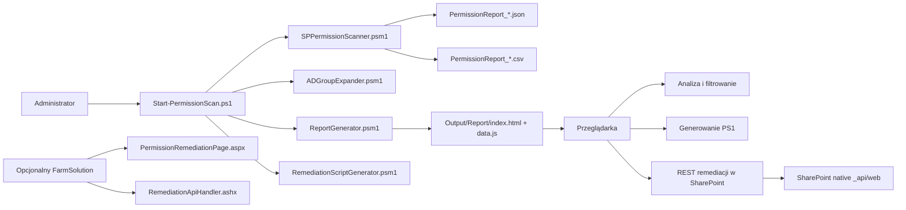

# SharePoint Permission Analyzer


Narzędzie do audytu uprawnień SharePoint Subscription Edition on-premises, zbudowane jako zestaw skryptów PowerShell, statyczny raport HTML oraz opcjonalny komponent server-side dla administracji remediacją po stronie SharePoint.

> [!IMPORTANT]
> Rozwiązanie jest przygotowane dla środowisk **SharePoint SE on-premises** i korzysta z **SSOM** oraz snap-inu `Microsoft.SharePoint.PowerShell`. To nie jest narzędzie dla SharePoint Online.

## Co robi projekt

- Skanuje farmę SharePoint na poziomach: `WebApplication -> SiteCollection -> Web -> List/Library -> Folder -> File/ListItem`.
- Zbiera przypisania ACL, rozpoznaje typy principalów i może rozwijać grupy SharePoint oraz grupy domenowe AD.
- Eksportuje wyniki do `JSON`, `CSV` oraz interaktywnego raportu `HTML` działającego offline.
- Pokazuje dashboard, tabelę uprawnień, drzewo lokalizacji, wyszukiwanie użytkownika i historię zmian między raportami.
- Obsługuje dwa główne tryby remediacji z poziomu raportu: generowanie skryptu `PS1` oraz bezpośrednie operacje przez natywny REST SharePoint, gdy raport jest hostowany w bibliotece.
- Zawiera też opcjonalny komponent `FarmSolution`, który udostępnia osobną stronę i handler administracyjny po stronie SharePoint.

## Architektura w skrócie



## Najważniejsze możliwości

| Obszar | Funkcja | Efekt |
| --- | --- | --- |
| Audyt | Skan całej farmy lub wybranego zakresu | Jednolity model danych uprawnień |
| Eksport | `JSON`, `CSV`, raport HTML | Dane dla analizy, Excela i prezentacji |
| Wizualizacja | Dashboard, wykresy, DataTables, jsTree | Szybka analiza anomalii i wyjątków |
| Wersjonowanie | Porównanie bieżącego i poprzedniego raportu | Widok zmian `+ / - / ~` |
| Remediacja | PS1 offline lub natywny REST SharePoint z poziomu raportu | Kontrolowane usuwanie ACL i przywracanie dziedziczenia |
| Publikacja | Upload raportu do biblioteki SharePoint | Użycie raportu bezpośrednio w portalu |

## Szybki start

### 1. Zweryfikuj lokalne biblioteki raportu

Biblioteki front-end są już dołączone do repozytorium. Jeśli chcesz je odtworzyć lub odświeżyć, użyj:

```powershell
Set-Location .\Report
.\Install-LocalLibraries.ps1
```

### 2. Dostosuj konfigurację

Najważniejsze pliki:

- `PowerShell/Config/ScanConfig.json`
- `PowerShell/Config/Exclusions.json`
- `PowerShell/Config/Whitelist.json`

### 3. Uruchom skan

```powershell
Set-Location .\PowerShell
.\Start-PermissionScan.ps1
```

### 4. Otwórz wynik

Po zakończeniu skanu sprawdź:

- `PowerShell/Output/PermissionReport_*.json`
- `PowerShell/Output/PermissionReport_*.csv`
- `PowerShell/Output/Report/index.html`

<details>
<summary>Dodatkowe scenariusze uruchomienia</summary>

```powershell
# Skan bez poziomu elementów i plików
.\Start-PermissionScan.ps1 -SkipItemLevelScan

# Tylko surowe przypisania SharePoint bez ekspansji grup
.\Start-PermissionScan.ps1 -RawAssignmentsOnly

# Włączenie ekspansji grup domenowych
.\Start-PermissionScan.ps1 -ExpandDomainGroups

# Publikacja raportu do biblioteki SharePoint
.\Start-PermissionScan.ps1 -SharePointLibraryUrl "http://portal.contoso.com/sites/Raporty/Documents"
```

</details>

## Struktura repozytorium

```text
.
|-- FarmSolution/
|   `-- SharePointPermissionAnalyzer/
|       |-- Layouts/PermissionAnalyzer/
|       |-- Features/PermissionAnalyzerFeature/
|       `-- Properties/
|-- PowerShell/
|   |-- Config/
|   |-- Modules/
|   |-- Logs/
|   |-- Output/
|   `-- Start-PermissionScan.ps1
|-- Report/
|   |-- assets/
|   |-- index.html
|   `-- Install-LocalLibraries.ps1
|-- Samples/
|-- DOKUMENTACJA_TECHNICZNA.html
|-- INSTRUKCJA_WDROZENIA.html
`-- INSTRUKCJA_WDROZENIA.md
```

## Artefakty i działanie raportu

- `JSON` zawiera pełny model danych: metadane skanu, statystyki, błędy i obiekty z przypisaniami.
- `CSV` spłaszcza wynik do wierszy gotowych do analizy w Excelu.
- `HTML` działa jako statyczna aplikacja SPA i ładuje dane z `data.js`.
- `data.js` osadza `SCAN_DATA`, `DIFF_DATA` i `SCAN_HISTORY` jako Base64, dzięki czemu raport działa bez połączenia z Internetem.

## Dokumentacja

- [Instrukcja wdrożenia](INSTRUKCJA_WDROZENIA.md)
- [Materiały do GitHub Wiki](wiki/Home.md)
- [Wiki: Dokumentacja techniczna](wiki/Dokumentacja-techniczna.md)

## Wymagania

| Obszar | Wymaganie |
| --- | --- |
| Platforma | SharePoint Subscription Edition on-premises |
| PowerShell | 5.1 |
| Model obiektowy | SharePoint SSOM |
| .NET | .NET Framework 4.8 |
| Uprawnienia skanu | Farm Administrator |
| AD | Dostęp LDAP, jeśli używana jest ekspansja grup domenowych |
| Przeglądarka | Nowoczesna przeglądarka z włączonym JavaScript |

## Uwagi implementacyjne

> [!NOTE]
> Repozytorium zawiera komplet warstwy PowerShell i raportu HTML oraz źródła opcjonalnego komponentu `FarmSolution`. Główna ścieżka remediacji w samym raporcie korzysta z natywnego REST SharePoint; `FarmSolution` jest dodatkową, odrębną warstwą administracyjną. Jeśli planujesz pełne paczkowanie i wdrażanie WSP, potraktuj katalog `FarmSolution/` jako bazę źródłową do dalszego domknięcia procesu build i deployment.

> [!NOTE]
> Konfiguracja `ScanConfig.json` jest aktywnie wykorzystywana przez skrypt skanujący. Część sekcji opisanych w plikach konfiguracyjnych, takich jak pełna logika whitelisty lub inkrementalność skanu, wymaga jeszcze pełnego dopięcia na poziomie kodu i została opisana dokładniej w dokumentacji technicznej.
